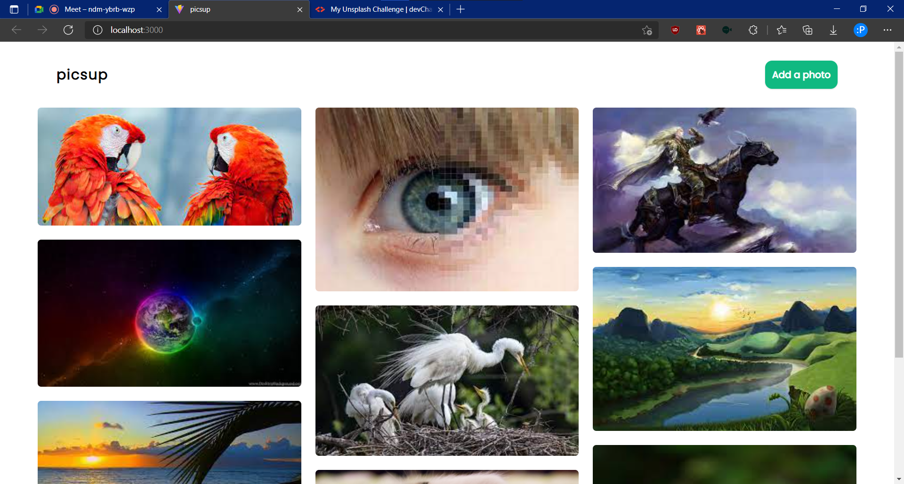

picsup
---
An image sharing platform. It is a our fullstack web project. [Android app available](https://github.com/pavi2410/picsup-Android).

### Screenshots


### Usage

To start the backend and frontend processes
```
npm run dev
```

### Tech Stack (MERN)
#### Backend
- [Node.js](https://nodejs.org/en/)
- [Express](https://expressjs.com/)
- [MongoDB](https://www.mongodb.com/)
- [Prisma](https://www.prisma.io/)
- [Morgan](https://www.npmjs.com/package/morgan)
- [Multer](https://www.npmjs.com/package/multer)

#### Frontend
- [React](https://reactjs.org/)
- [React Router](https://reacttraining.com/react-router/)
- [Vite](https://vitejs.org/)
- [Material-UI](https://mui.com/)
- [TailwindCSS](https://tailwindcss.com/)

### Created by Tilak and [Pavitra](https://pavi2410.me)